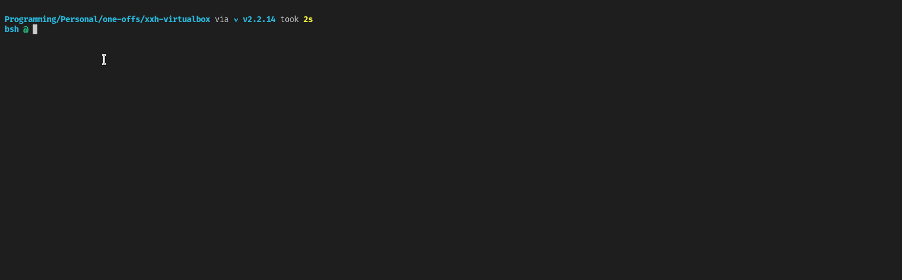

# Plugin Development using Vagrant

[Vagrant](https://www.vagrantup.com) from HashiCorp creates virtual environments that can easily allow unique testing destinations for your plugin development.

To develop using `Vagrant`, copy this folder to a new location and change the `config.vm.box` to the [a supported VN](https://app.vagrantup.com/boxes/search) that you would like to target.

## Functionality

You can start the VM using the following `Vagrantfile`:

```Vagrantfile
# vi: set ft=ruby :
Vagrant.configure("2") do |config|
  config.vm.box = "ubuntu/jammy64"
end

```

Start the environment using:

```sh
vagrant up
```

A typical development folder might look like this:

```
-rwxrwxr-x 1 mcrowe mcrowe  940 Feb 13 11:32 start.sh*
-rw-rw-r-- 1 mcrowe mcrowe 3020 Feb 13 08:05 Vagrantfile
drwxrwxr-x 4 mcrowe mcrowe 4096 Feb 13 10:08 xxh-plugin-bash-bashit/
drwxrwxr-x 4 mcrowe mcrowe 4096 Feb 13 08:56 xxh-plugin-prerun-dotbare/
```

The `start.sh` script starts an `xxh` session to the VM and maps in any `xxh-` folders in the session.  For example:

To reset everything and start again:

```sh
vagrant destroy && vagrant up
```

## Demo


